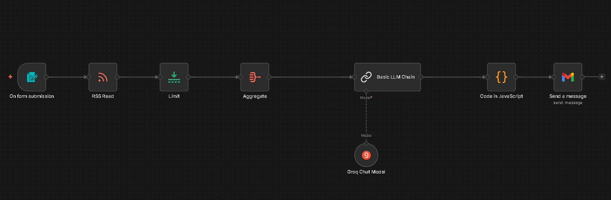

# Intelligence Newsletter: Automação com n8n e IA.

Este projeto é uma solução desenvolvida no **n8n**. Ele permite que, através do preenchimento de um formulário, o sistema busque as notícias mais recentes de um feed RSS, processe-as utilizando Inteligência Artificial (Groq) e envie um relatório formatado diretamente para o e-mail do usuário.

---

## Funcionalidades

* **Gatilho sob demanda:** A automação só inicia quando o usuário solicita via formulário.
* **Filtro inteligente:** Captura apenas as dez notícias mais recentes para evitar excesso de informação.
* **Análise estratégica:** A IA analisa o impacto de cada notícia.
* **Design chamativo:** Entrega final via e-mail com layout organizado.

---

## Tecnologias Utilizadas

* **[n8n](https://n8n.io/):** Plataforma de automação low-code para construção do fluxo.
* **[Groq Cloud](https://groq.com/):** IA de ultra velocidade.
* **Llama 3:** Modelo de linguagem utilizado para o processamento dos textos.
* **JavaScript:** Utilizado para a construção do template HTML da newsletter.
* **Gmail API:** Para o envio automatizado dos relatórios.

---

## Estrutura do Fluxo (Workflow)

1.  **On form submission:** Recebe a solicitação do usuário.
2.  **RSS Read:** Conecta-se ao feed de notícias e extrai os dados brutos.
3.  **Limit:** Filtra os dez itens mais recentes.
4.  **Aggregate:** Consolida os itens individuais em um único objeto de dados para processamento em bloco.
5.  **Basic LLM Chain + Groq:** Envia os dados para a IA com um prompt de análise de notícias.
6.  **Code in JavaScript:** Formata a saída da IA em um template HTML estilizado com CSS.
7.  **Send a message (Gmail):** Dispara o e-mail final para o destinatário.

---

## Resultado Final

O e-mail entregue possui uma estrutura dividida em:
* **Categoria:** Identificação automática do assunto da notícia (IA, Cibersegurança, etc.).
* **Resumo:** Sintetização da notícia.
* **Análise:** Análise de consequências e impactos gerados pelo acontecimento da notícia.
* **Link:** Botão para leitura da matéria completa na fonte original.

---

## Aprendizados

Este projeto foi fundamental para exercitar conceitos de:
* Manipulação do n8n.
* Integração de APIs de terceiros.
* Estilização básica de e-mails usando HTML e CSS dentro de fluxos de automação.

---
## Autoria

Desenvolvido por **Fabianne Silva**.

---